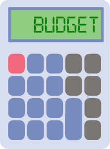

# CS3398-Ferengi-S2020

# Personal Budget App
### The team (Alex, Courtney, Shay, Scott, and Ryan) will be creating a personalized budgeting app for individual users to keep track of the user's income, expenses, savings, and financial goals we think would be helpful to the user. The user could be anyone looking to be more financially conscious. We are doing this in an attempt to help young/college students learn to manage their mmoney more effectively. It is not a skill that is readily taught and is often a hard learned lesson with many negative impacts that can arise (debt, low credit score, collections, wage garnishing). We want to make it easy and fun to manage money to build life skills that a person will use and teach/show to their kids.
## Status:
  - Alex: Currently learning what the code is doing. Next step is to build a profile page for the app. 
  - Courtney: Gaining a better understanding of Django
  
## General Info 

## Technologies
- Javascript
- Html
- CSS
- Django
- Python

## Features 
- Register: Users can register accout
- Login/Logout: Users can log out or in
- Password Reset: Users can request a email to reset password
- Profile: Users have a profile with an image, email and username
- Post: Users can share posts on blog
- Budget Basics: Saves and calculates recurring incomes and expenses 
- Saver: Plan for future costs 
- Reminder: remind user about upcoming dates and se if they need to budget accordingly 
- Nav bar: make it easier for user to maneuver through the website

## Team Features and Accomplishments
- Alex & Shay: FC_Ferengi.pdf - Flow chart to help visualize how a user will interact with the web app.
- Courtney: Nav bar for easier maneuvering around the web app
- Ryan: Home page, databases for user logins.
- Scott: Budget tab (adding expenses and revenues with reactivity and an easy naming convention that allows for backend integration.
website

## Team improvements
- Team: Utilize slack better and split up the coding into smaller sections so that more specific features 
can be created faster.
- Alex:
- Shay: I need to have better communication that is earlier and more productive with my team.
Also I need to speak up more about ideas or implementations that I am passionate about.
- Courtney: Familiarization with web app dev
- Ryan: Work better as a team in understanding the technology stack that we are developing on.
- Scott: As a team we could work together better by understanding what the team would like the end goal to be. In the first sprint it felt like there were seperate goals and motivations, in the second sprint I hope to work together as a team with a common goal of production.
